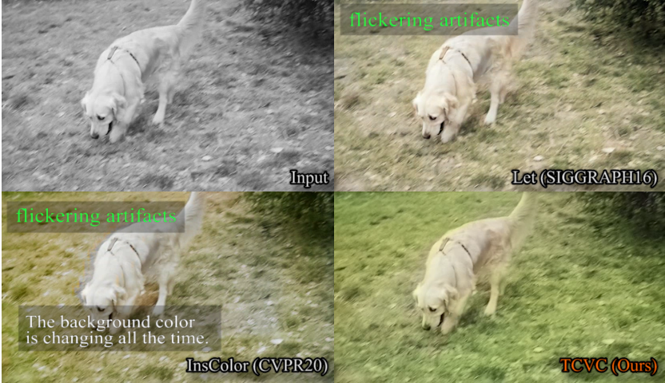
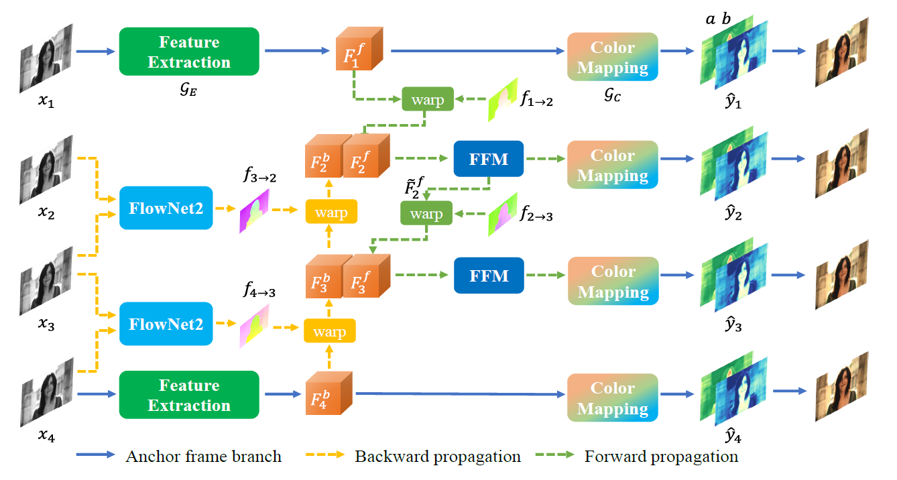

# TCVC-Temporally-Consistent-Video-Colorization
## Temporally Consistent Video Colorization with Deep Feature Propagation and Self-regularization Learning.  
[[paper]](https://arxiv.org/pdf/2110.04562.pdf) [[demo]](https://www.youtube.com/watch?v=c7dczMs-olE&t=22s)

## Brief Introduction
Video colorization is a challenging and highly ill-posed problem. Although recent years have witnessed remarkable progress in single image colorization, there is relatively less research effort on video colorization and existing methods always suffer from severe flickering artifacts (temporal inconsistency) or unsatisfying colorization performance. We address this problem from a new perspective, by jointly considering colorization and temporal consistency in a unified framework. Specifically, we propose a novel temporally consistent video colorization framework (TCVC). TCVC effectively propagates frame-level deep features in a bidirectional way to enhance the temporal consistency of colorization. Furthermore, TCVC introduces a self-regularization learning (SRL) scheme to minimize the prediction difference obtained with different time steps. SRL does not require any ground-truth color videos for training and can further improve temporal consistency. Experiments demonstrate that our method can not only obtain visually pleasing colorized video, but also achieve clearly better temporal consistency than state-of-the-art methods.

## Visual Comparison
### Colorization results on legacy black-and-white movies 
  
  
Image-based colorization method, e.g. InsColor(CVPR2021), tends to bring about severe flickering artifacts with inconsistent colors (highlighted in green rectangles). The colorization effect of video-based method FAVC(CVPR2019) is not satisfactory. Instead, our method can achieve good temporal consistency while maintaining excellent colorization performance.

### Comparison with image-based, video-based and post-processing methods
  
Image-based methods, like InsColor(CVPR2021), IDC(TOG2017), CIC(ECCV2016), are prone to produce severe flickering artifacts. Post-processing method BTC(ECCV2018) cannot achieve long-term temporal consistency well and cannot handle outliers. The results of FAVC(CVPR2019) are usually unsaturated and unsatisfactory.
  
  
Video demo and comparison can be found at this link: [[demo]](https://www.youtube.com/watch?v=c7dczMs-olE&t=22s)

## Method
  
The proposed TCVC framework (take N=4 for example). The anchor frame branch colorizes the two anchor frames and extracts the deep features for propagation. With bidirectional deep feature propagation, the internal frame features are all generated from anchor frames, which ensures the temporal consistency in high-dimensional feature space.

## Citation
If you find our work is useful, please kindly cite it.
  
'''BibTex
@article{liu2021temporally,
  title={Temporally Consistent Video Colorization with Deep Feature Propagation and Self-regularization Learning},
  author={Liu, Yihao and Zhao, Hengyuan and Chan, Kelvin CK and Wang, Xintao and Loy, Chen Change and Qiao, Yu and Dong, Chao},
  journal={arXiv preprint arXiv:2110.04562},
  year={2021}
}
'''